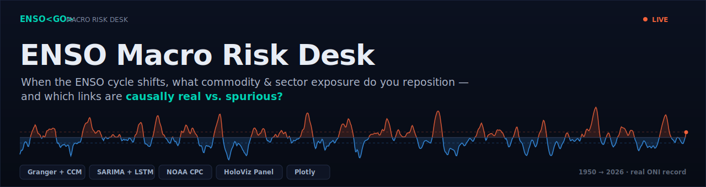
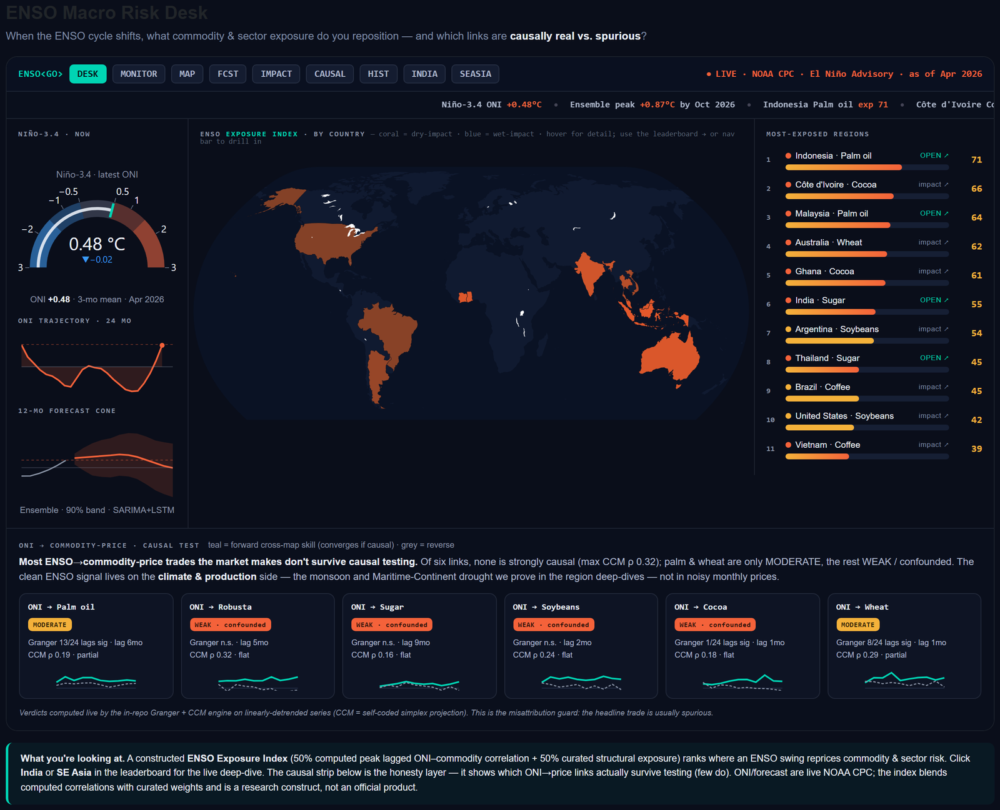
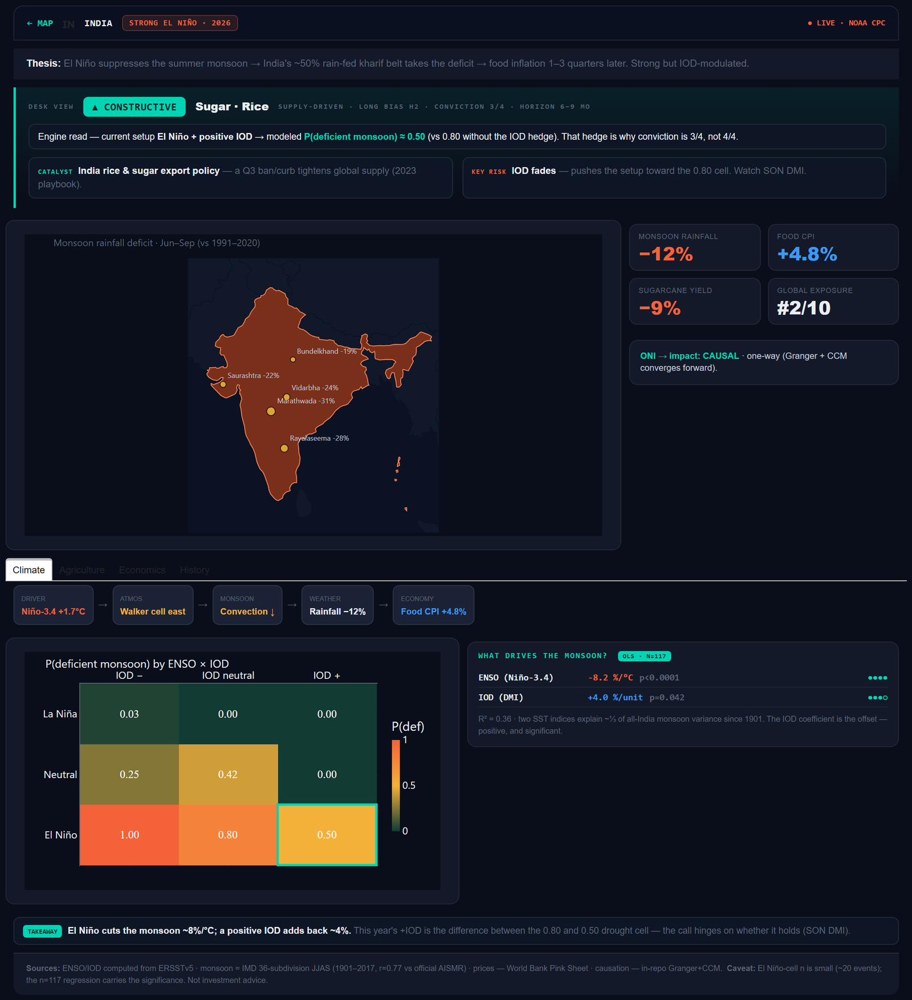
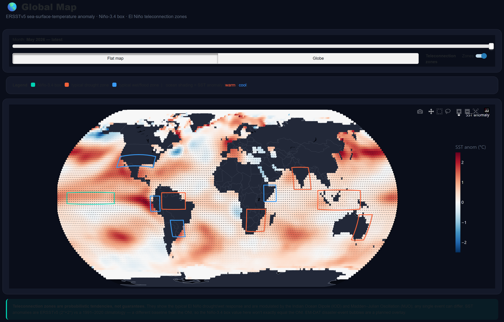
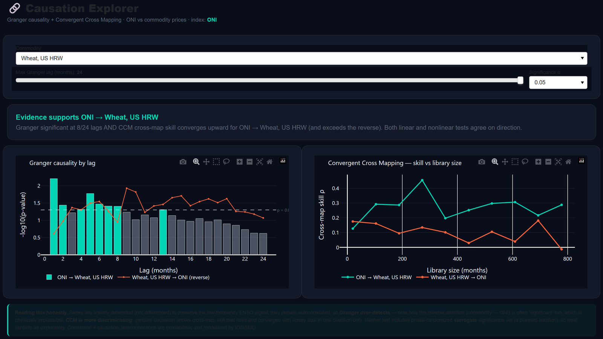
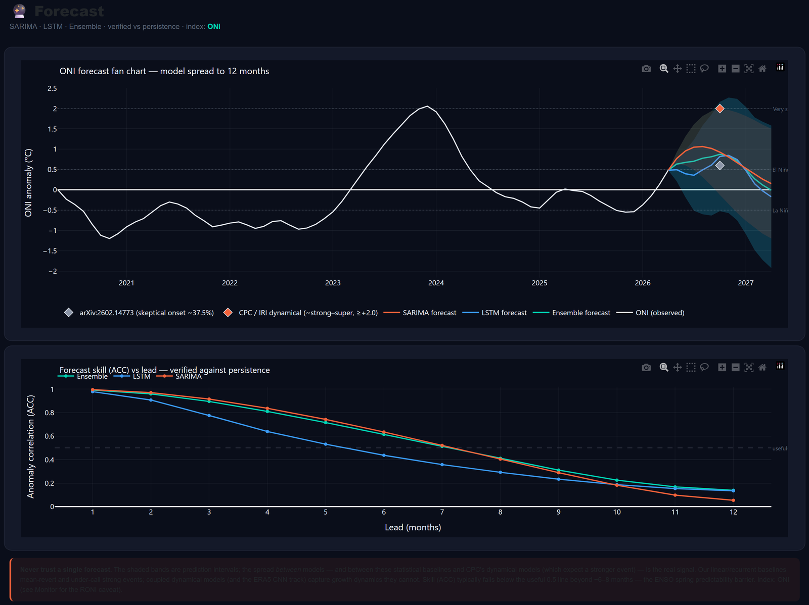

<a name="top"></a>

<div align="center">



# 🌊 ENSO Macro Risk Desk

**A Bloomberg-style climate-intelligence terminal that turns the El Niño / La Niña (ENSO) cycle into actionable commodity & sector positioning — with the causal rigor to tell which links are real and which are spurious.**

[](https://huggingface.co/spaces/DogInfantry/enso-macro-risk-desk)
[](https://www.python.org/downloads/release/python-3120/)
[](https://panel.holoviz.org/)
[](https://plotly.com/)
[](#-the-moat-causal-rigor)
[](https://www.cpc.ncep.noaa.gov/)
[](#-license--attribution)

### **▶ [Open the live dashboard →](https://huggingface.co/spaces/DogInfantry/enso-macro-risk-desk)**

**[Live Demo](https://huggingface.co/spaces/DogInfantry/enso-macro-risk-desk) · [The Moat](#-the-moat-causal-rigor) · [Screenshots](#-screenshots) · [9 Pages](#-the-nine-pages) · [Methodology](#-forecasting--causation-methodology) · [Run It](#-run-it-locally) · [Deploy](#-deployment) · [FAQ](#-faq)**

</div>

---

## What is the ENSO Macro Risk Desk?

The **ENSO Macro Risk Desk** is a production-grade, open-source Python dashboard that answers one question for a commodity / macro analyst or climate-aware portfolio manager: **when the El Niño–Southern Oscillation (ENSO) cycle shifts, what commodity and sector exposure should you reposition — and which of those links survive causal testing?**

It ingests canonical ENSO data directly from **NOAA CPC** (the Oceanic Niño Index), **ERSSTv5 sea-surface-temperature grids**, the **World Bank Pink Sheet** commodity database, and **IMD monsoon** records. It then runs a **dual-model forecasting engine** (SARIMA + PyTorch LSTM) and a **causal-inference engine** (Granger causality + Convergent Cross Mapping) across **nine interactive pages** — a dark, data-dense terminal UI, **no API keys required to start.**

The product philosophy is **describe → prescribe**: every region and commodity ends in a positioning view (constructive / cautious / watch + swing catalyst + risk), not just a chart.

> **Who it's for:** commodity & macro research analysts, climate-risk and energy-transition desks, agricultural economists, and data-science portfolio reviewers.

**TL;DR**
- 🌍 **ENSO Exposure Index** — a world choropleth + leaderboard ranking where an ENSO swing reprices commodity & sector risk.
- 🔬 **Causal rigor as the moat** — Granger + Convergent Cross Mapping (CCM) separate *real* ENSO→price links from spurious ones. Most don't survive — and that's the honest headline.
- 📈 **12-month forecasts** — SARIMA + LSTM ensemble, walk-forward backtested, beating persistence at all 12 leads.
- 🛰️ **Live data** — NOAA CPC ONI + ENSO advisory fetched at runtime; ERSSTv5 SST grids; 71 World Bank commodities.
- 🇮🇳 **Region deep-dives** — India (ENSO × Indian Ocean Dipole → monsoon → food CPI) and SE Asia (palm oil), each ending in a desk view.
- 🚀 **Live & auto-deployed** — running on Hugging Face Spaces, CI/CD from GitHub.

---

## 🖥️ Screenshots

> The **Macro Risk Desk** landing — left rail (Niño-3.4 gauge, ONI trajectory, 12-month forecast cone), the world **ENSO Exposure Index** choropleth, a most-exposed-regions leaderboard, and the **causation strip** (the honesty layer):

<div align="center">

</div>

<table>
<tr>
<td width="50%">

**🇮🇳 India deep-dive** — ENSO × IOD → monsoon → food CPI, with a desk view and the real OLS regression heatmap.



</td>
<td width="50%">

**🛰️ Global SST Map** — ERSSTv5 sea-surface-temperature anomalies with the classic El Niño equatorial-Pacific warm tongue + teleconnection zones.



</td>
</tr>
<tr>
<td width="50%">

**🔬 Causation Explorer** — live Granger + Convergent Cross Mapping on ONI vs. any commodity, with a plain-language verdict.



</td>
<td width="50%">

**📈 Forecast** — SARIMA + LSTM + ensemble fan chart with confidence bands and ACC-vs-lead skill.



</td>
</tr>
</table>

---

## 🎯 The Moat: Causal Rigor

Anyone can plot a correlation between El Niño and cocoa prices. The hard — and honest — part is asking **does it survive a causal test?** This desk runs two complementary engines on every ONI→commodity link:

- **Granger causality** (linear): does lagged ONI add predictive power over the commodity's own history?
- **Convergent Cross Mapping / CCM** (nonlinear, Sugihara et al. *Science* 2012): does cross-map skill *rise and converge* with library size in **one direction only**? Self-coded via simplex projection — no `pyEDM` dependency.

**The result is deliberately humbling.** Of the six headline ONI→commodity-**price** links on the desk, **none is strongly causal** (max CCM ρ ≈ 0.32); palm oil & wheat are only *moderate*, the rest *weak / confounded*. So the takeaway the desk leads with is:

> **Most ENSO→commodity-price trades the market makes don't survive causal testing.** The clean ENSO signal lives on the **climate & production** side — the monsoon and Maritime-Continent drought we *prove* in the region deep-dives — not in noisy monthly prices.

That "misattribution guard" — showing the *computed* verdict instead of an asserted one, even when it undercuts a tidy narrative — is the whole point. Cocoa and wheat were *expected* to fail; the data said wheat is actually one of the stronger ones, and the desk reports that, not the assumption.

---

## 🗂️ The Nine Pages

| # | Page | What it does |
|:-:|------|------|
| **00** | **Macro Risk Desk** (landing) | Command-bar terminal: Niño-3.4 gauge · ONI trajectory · forecast cone · **ENSO Exposure Index** choropleth · most-exposed leaderboard · **causal-test strip** |
| **01** | ENSO Monitor | Live ONI **+ RONI** dual series (1950–present), gauge, live NOAA advisory badge, CSV export |
| **02** | Global SST Map | ERSSTv5 2°×2° anomaly grids, flat + orthographic globe, teleconnection zones |
| **03** | Forecast | SARIMA + LSTM + ensemble fan chart, CI bands, ACC-vs-lead skill |
| **04** | Sector Impact | Detrended lag-correlation heatmap, ONI × 71 commodities, lags 0–24 mo |
| **05** | Causation Explorer | Live **Granger + CCM**, both directions, plain-language verdict |
| **06** | Historical Events | Per-event cards since 1950: peak ONI/RONI, Callahan & Mankin 2023 GDP losses |
| **07** | 🇮🇳 India deep-dive | **ENSO × IOD → monsoon → food CPI**; real OLS regression (n=117); desk view |
| **08** | 🌴 SE Asia deep-dive | Palm oil; honest **WATCH** — the ENSO-premium story fails its own composite |

**916 ENSO months · 42 events detected · 71 commodities · 2°×2° global SST grids from 1854 · 12-month forecast horizon · zero API keys required.**

---

## 🔬 Forecasting & Causation Methodology

### Forecasting
Two models share an identical walk-forward verification harness, scored against a **persistence reference** (last observed ONI held constant):

| Model | Type | Architecture | Result |
|-------|------|-------------|--------|
| **SARIMA** | Statistical | statsmodels SARIMAX(2,0,1)(1,0,0,12) | Beats persistence at all 12 leads ✅ |
| **LSTM** | Deep Learning | PyTorch, 2-layer, 64 hidden | Beats persistence at all 12 leads ✅ |

**Honest result:** SARIMA outperforms the LSTM on this short univariate ONI series. The LSTM needs ancillary indices (IOD/MJO/PDO) or spatial SST fields (CNN track) to close the gap — framing it otherwise would misrepresent the evidence. Both models' skill (ACC) drops below the 0.5 useful-skill threshold at **6–8 months**, consistent with the ENSO spring predictability barrier.

### Causation
Both tests run on **linearly detrended** (not differenced — differencing kills the low-frequency ENSO band) ONI vs. commodity series:

- **Granger causality** (linear): F-test across lags 0–24.
- **Convergent Cross Mapping** (nonlinear): in-repo simplex projection (NumPy/SciPy), no pyEDM (its multiprocessing is incompatible with the Panel server on Windows). Genuine causation → cross-map skill rises and converges with library size in *one direction only*.

Surrogate (phase-randomized) significance testing is on the roadmap; current verdicts are exploratory.

---

## 🏗️ Architecture

```
NOAA CPC · ERSSTv5 · World Bank · IMD          data/ingest/  ──►  data/cache/*.parquet
                                                data/process/ ──►  (phases · RONI · Granger+CCM · exposure index)
                                                      │
              forecasting/ (SARIMA · LSTM · ensemble · skill) ──►  forecasts/skill caches
                                                      │
                                                      ▼
   app.py  ──►  HoloViz Panel + Plotly  ──►  00 Desk · 01 Monitor · 02 Map · 03 Forecast
                                              04 Impact · 05 Causation · 06 History · 07 India · 08 SE Asia
                                                      │
                                      Dockerfile  ──►  🤗 Hugging Face Space  (CI/CD from GitHub)
```

The dashboard reads **parquet caches only** — the heavy ingest/forecast pipeline (PyTorch, xarray, netCDF4) runs offline, so the deployed image is lean and serves instantly.

---

## 🚀 Run It Locally

**Requires Python 3.12** (Hugging Face Spaces parity; the ML/geo stack lacks wheels on newer builds).

```bash
# 1 — environment
py -3.12 -m venv .venv
.venv\Scripts\activate          # Windows  ·  source .venv/bin/activate on macOS/Linux

# 2 — dependencies
pip install -r requirements.txt

# 3 — (optional) refresh live data into data/cache/*.parquet
python data/ingest/oni_fetcher.py -v
python data/ingest/pink_sheet.py -v

# 4a — serve the whole site (landing at / + all 9 pages) via the unified entry point
python app.py                   # → http://localhost:5006

# 4b — or serve a single page
panel serve dashboard/pages/00_landing.py --show
```

**No API keys required** for any module — every data source is free and public.

---

## ☁️ Deployment

**Live now:** **[huggingface.co/spaces/DogInfantry/enso-macro-risk-desk](https://huggingface.co/spaces/DogInfantry/enso-macro-risk-desk)** — Docker SDK, free CPU Basic.

Panel/Bokeh is a long-running WebSocket server, so it ships as a **Docker Space** (not Gradio/Static, and not Vercel without WASM conversion) running real `panel serve` via [`app.py`](app.py). A **GitHub Action** ([`.github/workflows/deploy-hf.yml`](.github/workflows/deploy-hf.yml)) auto-syncs the Space on every push to `master` — **push to GitHub → the Space redeploys itself**, and each run is recorded under the repo's **Deployments** tab. The serve-only dependency set ([`requirements-space.txt`](requirements-space.txt)) excludes torch/xarray/kaleido, keeping the image small.

---

## 📚 Data Sources

| Source | Provider | Module | Auth |
|:-------|:---------|:-------|:----:|
| [ONI ASCII feed](https://www.cpc.ncep.noaa.gov/data/indices/oni.ascii.txt) | NOAA CPC | `oni_fetcher.py` | None |
| [ENSO Diagnostic Discussion (PDF)](https://www.cpc.ncep.noaa.gov/products/analysis_monitoring/enso_advisory/ensodisc.pdf) | NOAA CPC / IRI | `advisory_fetcher.py` | None |
| [Pink Sheet — monthly commodities](https://www.worldbank.org/en/research/commodity-markets) | World Bank | `pink_sheet.py` | None |
| [ERSSTv5 netCDF grids](https://www.ncei.noaa.gov/pub/data/cmb/ersst/v5/netcdf/) | NOAA NCEI | `ersst_fetcher.py` | None |
| IMD 36-subdivision rainfall (JJAS monsoon) | India Met. Dept. | `monsoon_fetcher.py` | None |
| [ERA5 reanalysis](https://cds.climate.copernicus.eu/) · [USDA NASS](https://quickstats.nass.usda.gov) · [EM-DAT](https://www.emdat.be/) | Copernicus / USDA / CRED | *(roadmap)* | Free |

---

## ⚠️ Data Caveats & Known Limitations

Rigorous analysis means disclosing limits. Read before drawing conclusions.

1. **ONI vs RONI.** Charts label every index. On **16 Feb 2026 NOAA adopted RONI** (subtracts tropical-mean SST to remove background warming) as the *official* ENSO index; under RONI the 2023–24 El Niño is ~0.6 °C cooler. Don't compare ONI- and RONI-classified events directly. This repo's RONI is computed from ERSSTv5 on a fixed 1991–2020 base — it *approximates* the official value.
2. **The 3-month mean lags raw Niño-3.4.** A weekly spike can precede the smoothed ONI crossing ±0.5 °C by ~2 months. Current phase is fetched live, never hardcoded.
3. **Correlation ≠ causation.** Sector links are detrended Pearson r; the IOD and MJO can drive spurious co-movement. Causal direction needs Granger / CCM (Page 05) — and most price links *fail* it (see [The Moat](#-the-moat-causal-rigor)).
4. **Exposure Index is a research construct** — 50% computed peak lagged ONI–commodity correlation + 50% curated structural exposure. Not an official product.
5. **Source freshness.** The World Bank Pink Sheet workbook currently ends **2024-12**; fetchers degrade gracefully to cache. India crop/CPI tabs are illustrative pending USDA/FAOSTAT ingestion.

---

## ❓ FAQ

<details>
<summary><strong>What is the ENSO Macro Risk Desk?</strong></summary>

It's an interactive Python dashboard that maps the El Niño–Southern Oscillation (ENSO) cycle to commodity and sector risk, and stress-tests each link with causal inference (Granger + Convergent Cross Mapping). It's built for commodity/macro analysts and climate-risk desks, and it's [live on Hugging Face Spaces](https://huggingface.co/spaces/DogInfantry/enso-macro-risk-desk).
</details>

<details>
<summary><strong>What is ENSO, and why does it matter for commodity markets?</strong></summary>

ENSO is the dominant year-to-year driver of global climate variability. **El Niño** (ONI ≥ +0.5 °C) suppresses rainfall in Southeast Asia and Australia and enhances it on South America's west coast; **La Niña** (ONI ≤ −0.5 °C) reverses it. Because ENSO disrupts rainfall in the world's key agricultural zones, it is linked to price shocks in wheat, maize, rice, coffee, cocoa, and palm oil — typically 3–9 months after the SST anomaly peak.
</details>

<details>
<summary><strong>What is the difference between ONI and RONI?</strong></summary>

**ONI** is the 3-month running mean of Niño-3.4 SST anomalies against a rolling 30-year base. **RONI (Relative ONI)** subtracts the tropical-mean (20°S–20°N) anomaly, removing the warming trend that increasingly inflates ONI. NOAA adopted RONI as the official ENSO index in February 2026; under it the 2023–24 El Niño is ~0.6 °C weaker.
</details>

<details>
<summary><strong>What is Convergent Cross Mapping (CCM)?</strong></summary>

CCM (Sugihara et al., *Science*, 2012) is a nonlinear causal-inference method for dynamical systems. It tests whether X drives Y by checking whether Y's reconstructed attractor can recover X's states — and whether that cross-map skill *converges* as the observation library grows. Unlike Granger causality it doesn't assume linearity. This project implements CCM in-repo via simplex projection (NumPy/SciPy), without pyEDM, for Windows/Panel compatibility.
</details>

<details>
<summary><strong>Is it really live? How is it deployed?</strong></summary>

Yes — [running on Hugging Face Spaces](https://huggingface.co/spaces/DogInfantry/enso-macro-risk-desk) as a Docker Space serving `panel serve` via `app.py`, on the free CPU tier (it may cold-start after inactivity). A GitHub Action auto-redeploys on every push to `master`.
</details>

<details>
<summary><strong>Why does SARIMA outperform the LSTM?</strong></summary>

ONI is a short (~70-year) quasi-periodic univariate signal that SARIMA exploits directly through its seasonal AR structure. Without ancillary indices (IOD/MJO/PDO) or spatial SST input (CNN track), the LSTM lacks the signal to overcome SARIMA's parsimony at this data scale — an honest, common finding for short univariate climate series.
</details>

<details>
<summary><strong>Can I run it on macOS or Linux?</strong></summary>

Yes. Swap `.venv\Scripts\activate` for `source .venv/bin/activate`; the rest is cross-platform. The only Windows-specific choice is avoiding pyEDM — the in-repo CCM is fully portable.
</details>

---

## 📄 License & Attribution

Data © respective providers: NOAA/NWS (ONI, advisory, ERSSTv5), World Bank (Pink Sheet), India Meteorological Department (monsoon), Copernicus/ECMWF, USDA, FAO, CRED (EM-DAT). Code & dashboard: research and educational use — cite the primary data sources when reusing outputs.

**Key reference:** Callahan, C. W. & Mankin, J. S. (2023). Persistent effect of El Niño on global economic growth. *Science*, 381, 789–793. DOI: [10.1126/science.adf0374](https://doi.org/10.1126/science.adf0374)

---

<div align="center">

Built with [HoloViz Panel](https://panel.holoviz.org/), [Plotly](https://plotly.com/), [PyTorch](https://pytorch.org/), [statsmodels](https://www.statsmodels.org/), and data from [NOAA CPC](https://www.cpc.ncep.noaa.gov/) and the [World Bank](https://www.worldbank.org/).

<sub><b>Topics:</b> el-nino · la-nina · enso · enso-forecast · climate-risk · commodity-markets · macro-research · teleconnections · oceanic-nino-index · oni · roni · nino-3.4 · granger-causality · convergent-cross-mapping · ccm · sarima · lstm · time-series-forecasting · climate-finance · indian-ocean-dipole · monsoon · palm-oil · sea-surface-temperature · python-dashboard · holoviz-panel · plotly · data-visualization</sub>

**[▲ Back to top](#top)**

</div>
